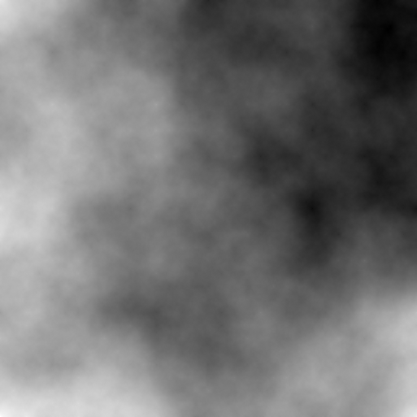
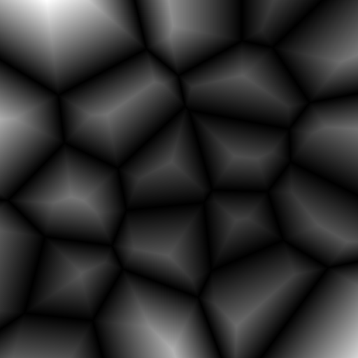
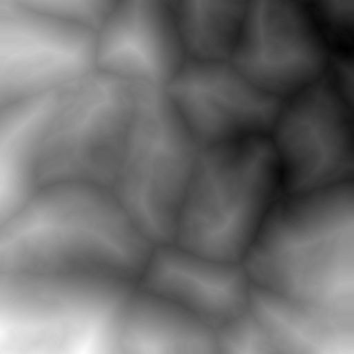

# Terrain Generation
Terrain Generation is an implementation of *Realitime Procedural Terrain Generation* for generating mountainous terrain as a C++ library using OpenCV. The program generates random height maps using a combination of midpoint displacement, Voronoi diagrams, simplex noise, thermal erosion, hydraulic erosion, and a custom erosion operation. With a little effort, the heightmap can be imported into Unity3D, Unreal Engine, Gazebo, or any other physics simulation environment to create 3D landscapes.

## References
**Jacob Olsen: Realtime Procedural Terrain Generation**, University of Southern Denmark, 2004. **[PDF](http://web.mit.edu/cesium/Public/terrain.pdf)**

**Simplex Noise Implementation:** https://github.com/SRombauts/SimplexNoise

## Dependencies
* OpenCV
* C++11

Refer to the following sources for instructions on installing OpenCV: [Windows](https://www.learnopencv.com/install-opencv3-on-windows/) and [Ubuntu](https://www.learnopencv.com/install-opencv3-on-ubuntu/).

*Note: Tested on Windows 10 and Ubuntu 16.04, but it should compile on any platform*

## Building
    mkdir build && cd build
    cmake -DBUILD_TESTS=ON -DBUILD_UNITY=OFF -DBUILDOpenMP=ON ..
    make -j8

## Running Demos

### Diamond-Square algorithm
    test_diamond_square 9 0.5 # Diamond-square algorithm with side lengths s = 2^9 + 1 = 513 and persistence = 0.5

### Voronoi Diagrams
    test_voronoi -1 1 20 # Voronoi diagram with c1=-1, c2=1, and npoints=50

### Combination
    test_combine -1 1 20 

### Perturbation Filter
    test_perturb 0.1 # Run perturbation with magnitude of 0.1

### Thermal Erosion
    test_thermal_erosion 50 # 50 Iterations of thermal erosion

### Hydraulic Erosion
    test_hydraulic_erosion 50 0.1 0.1 0.5 0.1

### Fast Erosion
    test_fast_erosion 50

